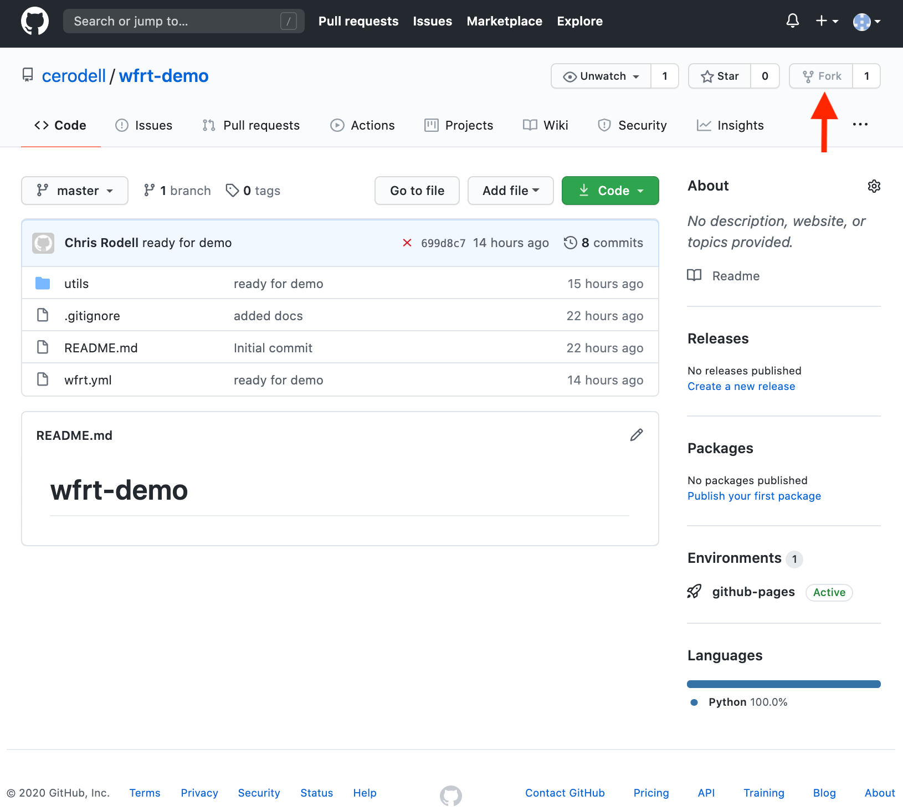

WFRT Demo
===========

Howdy! Please start by forking the `wrft-demo <https://github.com/cerodell/wfrt-demo>`_ repository from my GitHub account.

Fork repository
----------------

After you have forked the ``wfrt-demo`` clone from your GitHub to your local machine.

Clone repository
----------------

ssh
++++++++

.. code-block:: bash

    git clone git@github.com:<username>/wfrt-demo.git

https
++++++++

.. code-block:: bash

    git clone https://github.com/<username>/wfrt-demo.git

I hope everyone has an `ssh key <https://docs.github.com/en/github/authenticating-to-github/connecting-to-github-with-ssh>`_ setup with `GitHub <https://github.com/>`_ if not I hope you know your GitHub password and like typing it!

Here is what the repo contains
*The wfrt.yml will be helpful for the installation processes*

.. code-block:: bash

    wfrt-demo/
    ├── README.md
    ├── utils
    │   └── foo.py
    └── wfrt.yml
