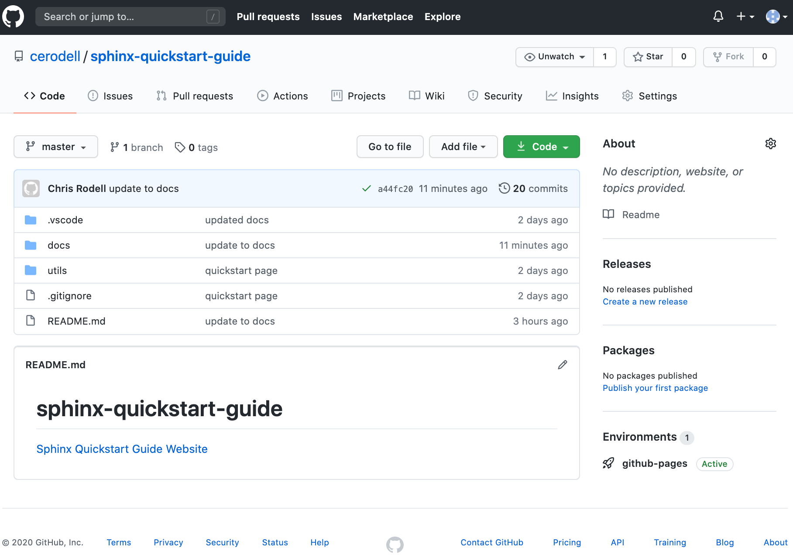
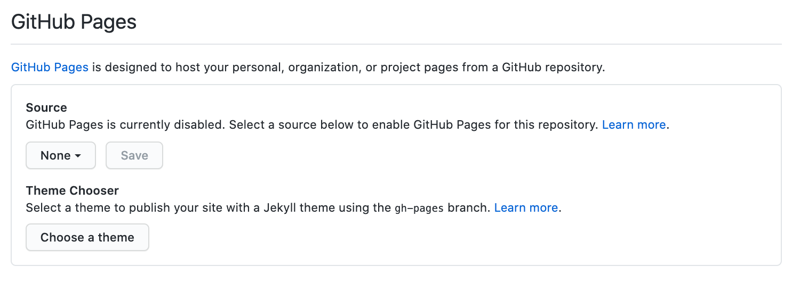
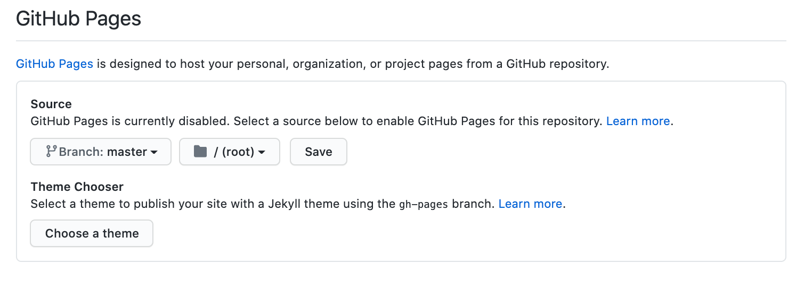
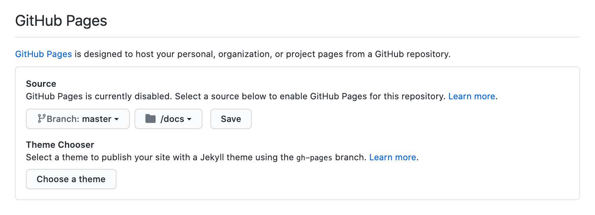
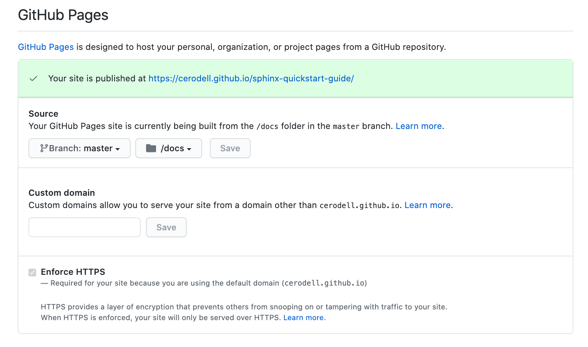

GitHub Pages
==============

On your `GitHub <https://github.com/>`_ account. Go to the project repository where you have added the docs folder.

Settings
---------------

Click Settings

GitHub Page
-------------

On the left hand menu select Pages and under source change ``None`` to ``master`` (or ``main`` the new github nomenclature)...

Folder
-------

...and   change ``root/`` folder to ``docs/`` folder

Save
------

Click Save

We now need to wait a few seconds and refresh our browser.

Hopefully, you will see that the website has been published!

Follow the link to see your website :)
