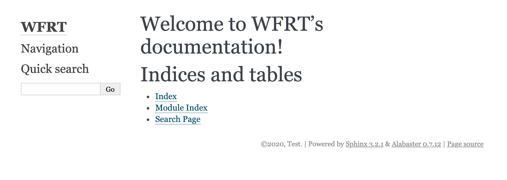

Sphinx Themes
===============

Default Theme
---------------

the website will look something like this:

Kinda boring.....

Add / Install Theme
---------------------

Let spice this up and a theme to your webpage!!

You can check out some of the `Sphinx themes here <https://sphinx-themes.org/>`_
 * There are others as well. 

For now, let's use the `Read the Docs Sphinx Theme <https://github.com/readthedocs/sphinx_rtd_theme>`_

First, we need to install ``sphinx_rtd_theme``

.. code-block:: bash 

	conda install -c anaconda sphinx_rtd_theme	

or

.. code-block:: bash 

    pip install sphinx-rtd-theme

Add to Conf
------------

With the theme installed we need to add the extension to our ``conf.py`` file in the ``source/`` folder

Open ``conf.py``...

.. code-block:: bash 

    cd source/
    vi conf.py

...and add the following 

.. code-block:: bash 

    import sphinx_rtd_theme

    extensions = [
        ...
        "sphinx_rtd_theme",
    ]

    html_theme = "sphinx_rtd_theme"

Clean / Make HTML
--------------------

Now, let's remake our website with the new theme by first cleaning than remaking our build folder.

.. note::
    You need to be in the docs folder when running ``make html`` or ``clean html``

We do that by running the following

.. code-block:: bash 

    make clean
    make html

Let's push this new work to `GitHub <github.com>`_ and see our website theme.

.. code-block:: bash 

    git add .
    git commit -m "added theme to docs"
    git push

