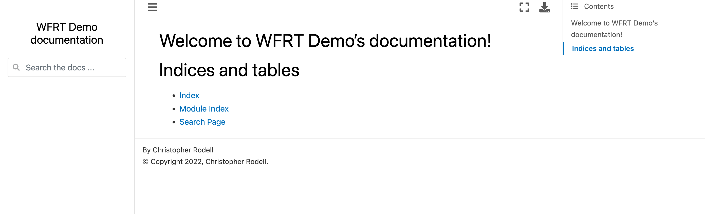

Sphinx Themes
===============

Default Theme
---------------

The website will look something like this:

.. figure:: _static/img/git-wfrt.png
    :alt: alternate text
    :width: 800
    :align: center

Kinda boring.....

Add / Install Theme
---------------------

Let spice this up and a theme to your webpage!

You can check out some of the `Sphinx themes here <https://sphinx-themes.org/>`_
 * There are others as well.

For now, let's use the `Executable Book Theme <https://sphinx-book-theme.readthedocs.io/en/stable/>`_

First, we need to install ``sphinx_book_theme``

.. code-block:: bash

	conda install -c anaconda sphinx-book-theme

or

.. code-block:: bash

    pip install sphinx-book-theme

Conf
======

Now let's dive into the ``conf.py`` file and our theme and some other usefull extentions

Here is what your ``conf.py`` file looks like currently

.. code-block:: python

    # list see the documentation:
    # https://www.sphinx-doc.org/en/master/usage/configuration.html

    # -- Path setup --------------------------------------------------------------

    # If extensions (or modules to document with autodoc) are in another directory,
    # add these directories to sys.path here. If the directory is relative to the
    # documentation root, use os.path.abspath to make it absolute, like shown here.
    #
    # import os
    # import sys
    # sys.path.insert(0, os.path.abspath('.'))

    # -- Project information -----------------------------------------------------

    project = 'WFRT-DEMO'
    copyright = '2020, Chris'
    author = 'Chris'

    # -- General configuration ---------------------------------------------------

    # Add any Sphinx extension module names here, as strings. They can be
    # extensions coming with Sphinx (named 'sphinx.ext.*') or your custom
    # ones.
    extensions = [
    ]

    # Add any paths that contain templates here, relative to this directory.
    templates_path = ['_templates']

    # List of patterns, relative to source directory, that match files and
    # directories to ignore when looking for source files.
    # This pattern also affects html_static_path and html_extra_path.
    exclude_patterns = []

    # -- Options for HTML output -------------------------------------------------

    # The theme to use for HTML and HTML Help pages.  See the documentation for
    # a list of builtin themes.
    #
    html_theme = 'alabaster'

    # Add any paths that contain custom static files (such as style sheets) here,
    # relative to this directory. They are copied after the builtin static files,
    # so a file named "default.css" will overwrite the builtin "default.css".
    html_static_path = ['_static']

Add to Conf
------------

Now open the ``conf.py`` file in the ``source/`` folder and add the following to ``Path setup``...

.. code-block:: python

    # -- Path setup --------------------------------------------------------------
    # If extensions (or modules to document with autodoc) are in another directory,
    # add these directories to sys.path here. If the directory is relative to the
    # documentation root, use os.path.abspath to make it absolute, like shown here.
    #
    import os
    import sys
    sys.path.insert(0, os.path.abspath('..'))
    sys.path.insert(0, os.path.abspath('../../'))

and than add the following from ``General configuration`` down..

.. code-block:: python

    # -- General configuration ---------------------------------------------------

    # Add any Sphinx extension module names here, as strings. They can be
    # extensions coming with Sphinx (named 'sphinx.ext.*') or your custom
    # ones.

    extensions = [
        "sphinx.ext.mathjax",
        "sphinx.ext.autodoc",
        "sphinx.ext.coverage",
        "sphinx.ext.napoleon",
        "sphinx.ext.autosectionlabel",
        "nbsphinx",
        "myst_parser",
        "sphinx_copybutton",
    ]

    # use language set by highlight directive if no language is set by role
    inline_highlight_respect_highlight = False

    # use language set by highlight directive if no role is set
    inline_highlight_literals = False

    # Add any paths that contain templates here, relative to this directory.
    templates_path = ['_templates']

    # List of patterns, relative to source directory, that match files and
    # directories to ignore when looking for source files.
    # This pattern also affects html_static_path and html_extra_path.
    exclude_patterns = ['_build', 'Thumbs.db', '.DS_Store']

    # -- Options for HTML output -------------------------------------------------

    # The theme to use for HTML and HTML Help pages.  See the documentation for
    # a list of builtin themes.
    #
    html_theme = 'sphinx_book_theme'

    # # Add any paths that contain custom static files (such as style sheets) here,
    # # relative to this directory. They are copied after the builtin static files,
    # # so a file named "default.css" will overwrite the builtin "default.css".
    html_static_path = ['_static']

Clean / Make HTML
--------------------

Now, let's remake our website with the new theme and added extentions by first cleaning than remaking our build folder.

.. note::
    You need to be in the docs folder when running ``make html`` or ``clean html``

We do that by running the following

.. code-block:: bash

    make clean
    make html

Let's push this new work to `GitHub <github.com>`_ and see our website theme.

.. code-block:: bash

    git add .
    git commit -m "added theme to docs"
    git push

New Theme
---------------

Now the website will look something like this:

